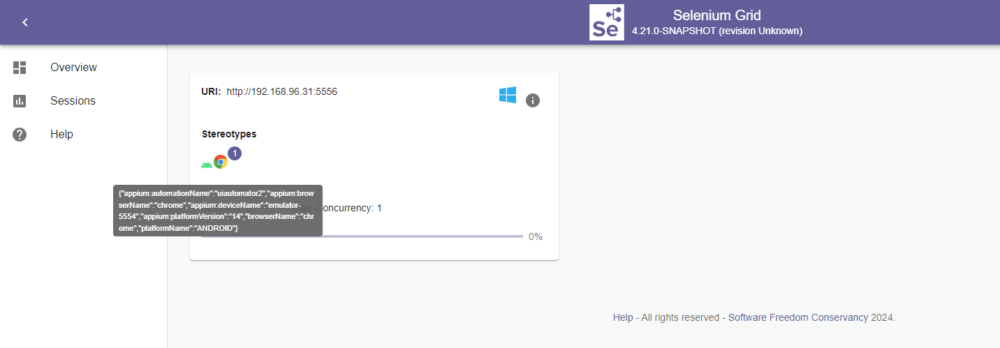

## Download [selenium-server.jar](https://github.com/NDViet/selenium/releases/download/nightly/selenium-server-4.21.0-SNAPSHOT.jar)

## Download & install Appium & drivers
```
> appium -v
2.5.4
```
```
t> appium driver list --install
✔ Listing installed drivers
- uiautomator2@3.1.0 [installed (npm)]
```

JDK is used
```
> java -version
openjdk version "17.0.2" 2022-01-18
OpenJDK Runtime Environment (build 17.0.2+8-86)
OpenJDK 64-Bit Server VM (build 17.0.2+8-86, mixed mode, sharing)
```

Pre-configure appium-chromedriver if needed under `C:\Users\%USERNAME%\.appium\node_modules\appium-uiautomator2-driver\node_modules\appium-chromedriver\chromedriver\win`

## Start Selenium Grid

### Hub
```
java -jar selenium-server-4.21.0-SNAPSHOT.jar hub
```

For debug purpose, add `--log-level=FINE` to see more logs

### Node
Create config.toml
```toml
[server]
port = 5556

[node]
detect-drivers = false

[relay]
url = "http://localhost:4723"
status-endpoint = "/status"
protocol-version = "HTTP/1.1"
configs = [
    '1', '{"platformName": "android", "appium:platformVersion": "14", "appium:deviceName": "emulator-5554", "appium:automationName": "uiautomator2", "appium:browserName": "chrome", "browserName": "chrome"}'
]
```

Start the Node
```
java -jar selenium-server-4.21.0-SNAPSHOT.jar node --config config.toml
```

## Start Appium Server
```
> appium server
[Appium] Welcome to Appium v2.5.4
[Appium] The autodetected Appium home path: C:\Users\%USERNAME%\.appium
[Appium] Attempting to load driver uiautomator2...
[Appium] Requiring driver at C:\Users\%USERNAME%\.appium\node_modules\appium-uiautomator2-driver\build\index.js
[Appium] AndroidUiautomator2Driver has been successfully loaded in 1.135s
[Appium] Appium REST http interface listener started on http://0.0.0.0:4723
[Appium] You can provide the following URLs in your client code to connect to this server:
[Appium]        http://192.168.x.x:4723/
[Appium]        http://127.0.0.1:4723/ (only accessible from the same host)
[Appium]        http://172.17.x.x:4723/
[Appium]        http://172.19.x.x:4723/
[Appium] Available drivers:
[Appium]   - uiautomator2@3.1.0 (automationName 'UiAutomator2')
[Appium] No plugins have been installed. Use the "appium plugin" command to install the one(s) you want to use.
[HTTP] --> GET /status
[HTTP] {}
[AppiumDriver@33f1] Calling AppiumDriver.getStatus() with args: []
[AppiumDriver@33f1] Responding to client with driver.getStatus() result: {"ready":true,"message":"The server is ready to accept new connections","build":{"version":"2.5.4"}}
[HTTP] <-- GET /status 200 6 ms - 110
```

With this setup, we can run tests on emulator devices using Appium server through Selenium Grid.

