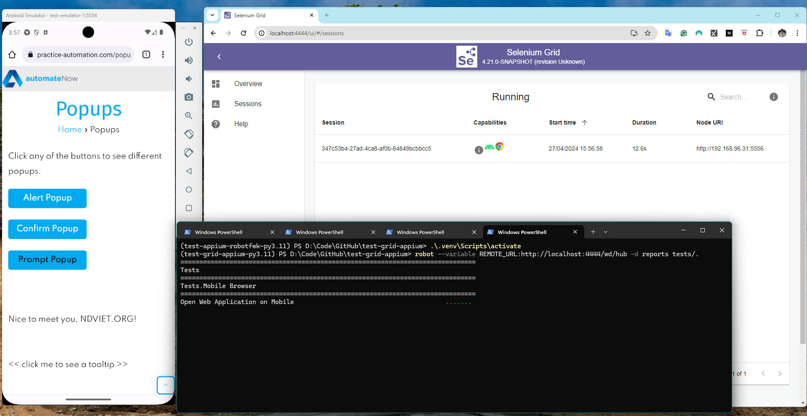

Sample tests using `Robot Framework` with `SeleniumLibrary`, tests target to run on remote `Selenium Grid`.
The Grid setup with Hub and a node is configured relay service to Appium server to run tests on emulator devices.

---

This project use Poetry to manage dependencies and virtual environment.

Required Python is installed on the system.

To install Poetry, run the following command

```bash
pip install poetry
```

To verify Poetry is installed successfully, `poetry --version` should return the version of Poetry.

To install the dependencies, run the following command:

```bash
poetry install
```

Details dependencies are listed in the [pyproject.toml](pyproject.toml) or [requirements.txt](requirements.txt) file.

To activate the virtualenv in-project, run the following command:

Windows
```bash
.venv\Scripts\activate
```

Unix
```bash
.venv/bin/activate
```

---

Walk through the [Installation](INSTALLATION.md) section to start the Selenium Grid and Appium server before running the tests.

---

Run Robot Framework test cases

```bash
robot --variable REMOTE_URL:http://localhost:4444/wd/hub -d reports tests/.
```

Reports will be generated in the `reports` directory.

The test execution looks like

